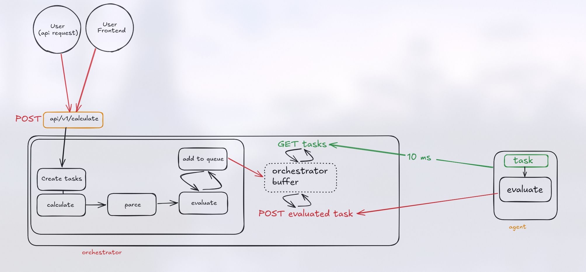
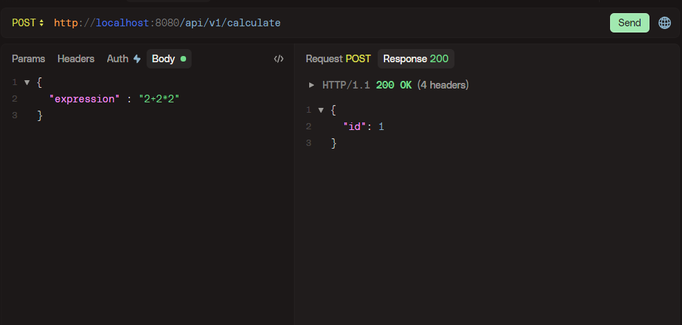
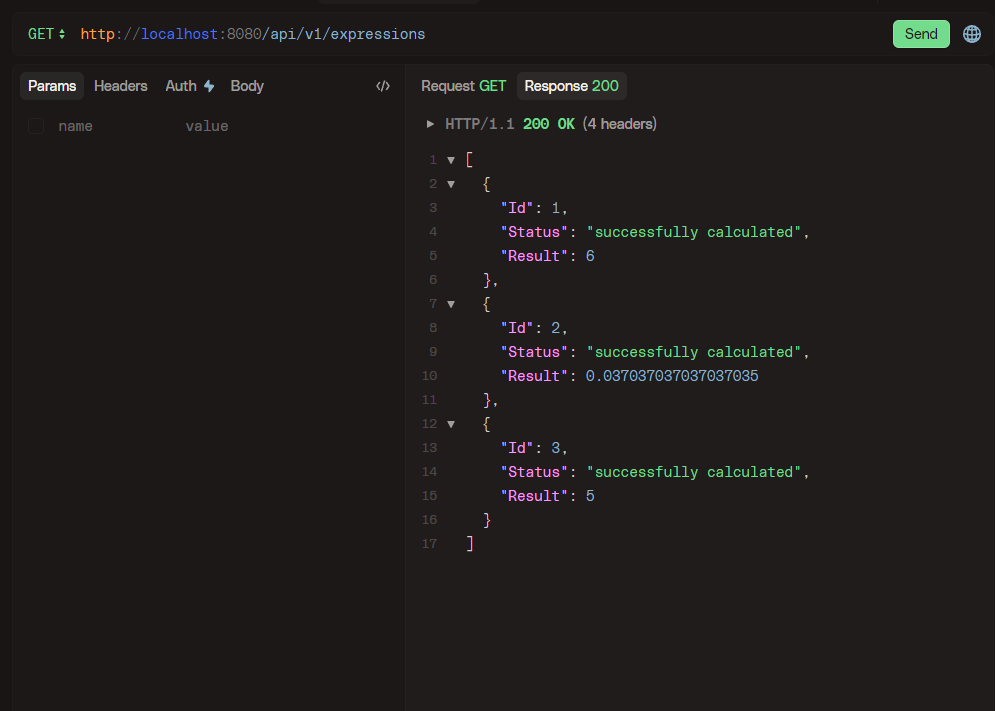

# ПРОШУ ПРОЧИТАЙТЕ ПЕРЕД ОТКРЫТИЕМ ПРОЕКТА

### ПОЖАЛУЙСТА УЧТИТЕ, ЧТО У МЕНЯ БЫЛО 3 ДНЯ НА ВЫПОЛНЕНИЕ !ВСЕГО СПРИНТА!
собственно поэтому мне пришлось допиливать после ДД

Я сделал чуть позже дедлайна!
Не давлю на жалость, но у меня была уважительная причина - олимпиады. Проблема в том, что я фронтендер и готовился к фронтенд треку :(

За Этот год (эти два месяца) у меня уже почти 300 коммитов, чтобы вы не думали, что я занимался фигней) (большинство на гитлабе)
Если хотите, можете удостовериться, просмотрев мои гх проекты (+ 1 выгружу чуть позже (самый объемный) - индивидуальный проект PROD-а)


Работающая версия появилась после коммита "ОНО РАБОТАЕТ"

___

## Фронтенд

ссылка на фронтенд репозиторий: 

https://github.com/Laynexx-ns/yalms-frontend


___
## Запуск и установка

Клон репы:

```shell
#ssh
git@github.com:Laynexx-ns/finalTaskLMS.git

#https
https://github.com/Laynexx-ns/finalTaskLMS.git
```

___

Запускается в двух разных файлах - `cmd/agent/main.go` и  `cmd/orchestrator/main.go`

Запуск оркестратора

```shell
go run .\cmd\orchestrator\main.go
```

Запуск агента

```shell
go run .\cmd\agent\main.go
```


## Устройство




К сожалению нет времени на норм ридми( Мб чуть позже выложу фронт.

Тесты есть в `orchestrator/orchestrator_test.go` и `agent/internal/handlers/evaluate-handler_test.go`

___
## Фотки запросов





Это небольшой костыль чтобы агент не плакал и чтобы миру было веселее, но таски можно подгружать)


___
## Еще печальки

В прошлый раз я получил 100 баллов и потратил огромное количество времени и всем, у кого проверял, делал СУПЕР подробное ишью. Надеюсь это потраченное время окупится.
Это я к тому, что я шарю, что и как писать, просто реально нет времени :(

есть +- удобное логирование, но только в консоль


```

く__,.ヘヽ.　　　　/　,ー､ 〉
　　　　　＼ ', !-─‐-i　/　/´
　　　 　 ／｀ｰ'　　　 L/／｀ヽ､
　　 　 /　 ／,　 /|　 ,　 ,　　　 ',
　　　ｲ 　/ /-‐/　ｉ　L_ ﾊ ヽ!　 i
　　　 ﾚ ﾍ 7ｲ｀ﾄ　 ﾚ'ｧ-ﾄ､!ハ|　 |
　　　　 !,/7 '0'　　 ´0iソ| 　 |　　　
　　　　 |.从"　　_　　 ,,,, / |./ 　 |
　　　　 ﾚ'| i＞.､,,__　_,.イ / 　.i 　|                   НЕ БЕЙТЕ ПОЖАЛУЙСТА!!!!
　　　　　 ﾚ'| | / k_７_/ﾚ'ヽ,　ﾊ.　|        
　　　　　　 | |/i 〈|/　 i　,.ﾍ |　i　|
　　　　　　.|/ /　ｉ： 　 ﾍ!　　＼　|
　　　 　 　 kヽ>､ﾊ 　 _,.ﾍ､ 　 /､!
　　　　　　 !'〈//｀Ｔ´', ＼ ｀'7'ｰr'
　　　　　　 ﾚ'ヽL__|___i,___,ンﾚ|ノ
　　　　　 　　　ﾄ-,/　|___./
　　　　　 　　　'ｰ'　　!_,.: 

```