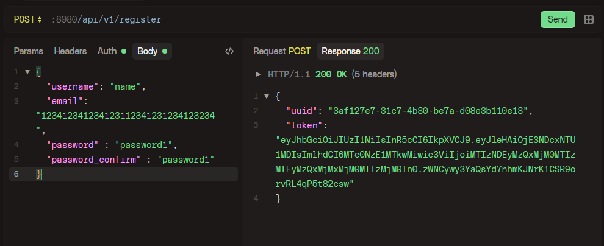

# NDX GOCALC'24


Приветик! 

**Немного про мой проект:**

* Используется микросервисная архитектура
* Используется squirrel для защиты от sql инъекций (где это уместно)
* Регистрация/Авторизация с поддержкой jwt-токена
* Используется крутая библиотека cleanenv для упрощения взаимодействия с конфигами
* Есть миграционные файлы (к сожалению автомиграция вроде не работает)
* Используется удобный и быстрый логгер Zap

# Гайд по запуску


Создайте файл `config/config.yml`

1. Если вы хотите использовать **докер** для запуска, вставьте туда это:
```yaml   
GATEWAY_PORT: 8080

AGENT:
AGENT_PORT: 50052
AGENT_HOST: "ndx_agent-container"
AGENT_TIME_CONF:
TIME_ADDITION_MS: 100
TIME_SUBTRACTION_MS: 100
TIME_MULTIPLICATIONS_MS: 100
TIME_DIVISIONS_MS: 100

ORCHESTRATOR:
ORCHESTRATOR_PORT: 50051
ORCHESTRATOR_HOST: "ndx_orchestrator-container"

USER_SERVICE:
USER_SERVICE_PORT: 50053
USER_SERVICE_HOST: "ndx_user-container"

POSTGRES:
POSTGRES_HOST: "ndx_postgres-container"
POSTGRES_PORT: 5432
POSTGRES_USER: "root"
POSTGRES_PASSWORD: password
POSTGRES_DB: "postgres"
POSTGRES_MIN_CONNS: 5
POSTGRES_MAX_CONNS: 10
POSTGRES_MAIN_SCHEMA: "public"

JWT_SECRET_KEY: "zxc!"
#или любой другой секрет
```

2. Если хотите запустить локально, без докера, вам в любом случае необходимо запустить бд)
как ее подключить, настройте конфиг сами) в остальном: 


```yaml
GATEWAY_PORT: 8080

AGENT:
  AGENT_PORT: 50052
  AGENT_HOST: "localhost"
  AGENT_TIME_CONF:
    TIME_ADDITION_MS: 100
    TIME_SUBTRACTION_MS: 100
    TIME_MULTIPLICATIONS_MS: 100
    TIME_DIVISIONS_MS: 100

ORCHESTRATOR:
  ORCHESTRATOR_PORT: 50051
  ORCHESTRATOR_HOST: "localhost"

USER_SERVICE:
  USER_SERVICE_PORT: 50053
  USER_SERVICE_HOST: "localhost"

POSTGRES:
  POSTGRES_HOST: "localhost"
  POSTGRES_PORT: 5433
  POSTGRES_USER: "root"
  POSTGRES_PASSWORD: password
  POSTGRES_DB: "postgres"
  POSTGRES_MIN_CONNS: 5
  POSTGRES_MAX_CONNS: 10
  POSTGRES_MAIN_SCHEMA: "public"

JWT_SECRET_KEY: "zxc!"
#или любой другой секрет
```


Пропишите 
```shell
make generate_api
```
или вручную введите команды из `Makefile`


Запустите через docker-compose
```shell
docker compose down
docker compose build
docker compose up -d
```

Или запускайте вручную каждый сервис через ```go run path/main.go```


> [!note]
> Если не работают автомиграции, выполните их самостоятельно, пожалуйста


___


# Архитектура


___

## Немного про сервисы

### 1. Orchestrator (orch)
Главный сервер, на который отправляются вычислительные запросы.

#### Запросы

1. Запрос на получение информации о конкретном вычислении (по его id)
```
GET (need bearer token)
:8080/api/v1/expression/{evaluation_id}

evaluation_id -> int
```

Пример: 


2. Запрос на создание нового вычисления 
```
POST (need bearer token)
:8080/api/v1/expressions

body:
{
  "expression" : "" (string)
  "user_id" : "" (uuid.UUID)
}
```

Пример:


3. Получение всех вычислений юзера
```
GET (need bearer token) 
:8080/api/v1/expressions/{user_id}

user_id -> uuid.UUID

```

___

### 2. User-service или Auth-service

Сервис, выполняющий регистрацию, авторизацию и установление токена через куки

> Важно! Я понимаю, что возвращать токен в респонсе КРАЙНЕ небезопасно, однако так
> проверяющим будет куда легче проверить т.к. не все платформы тестирования поддерживают автосет кук

1. Регистрация
```
POST
:8080/api/v1/register

body:
{
  "username": "",
  "email": "",
  "password" : "",
  "password_confirm" : ""
}

all fields are string
```




2. Логин
```
POST
:8080/api/v1/register

body:
{
  "email": "",
  "password" : ""
}

all fields are string
```

> Я знаю, что возвращаю не тот токен, вскоре пофиксим)


___


По вопросам обращайтесь в телеграм `@laynexx`

```
く__,.ヘヽ.　　　　/　,ー､ 〉
　　　　　＼ ', !-─‐-i　/　/´
　　　 　 ／｀ｰ'　　　 L/／｀ヽ､
　　 　 /　 ／,　 /|　 ,　 ,　　　 ',
　　　ｲ 　/ /-‐/　ｉ　L_ ﾊ ヽ!　 i
　　　 ﾚ ﾍ 7ｲ｀ﾄ　 ﾚ'ｧ-ﾄ､!ハ|　 |
　　　　 !,/7 '0'　　 ´0iソ| 　 |　　　
　　　　 |.从"　　_　　 ,,,, / |./ 　 |
　　　　 ﾚ'| i＞.､,,__　_,.イ / 　.i 　|                   
　　　　　 ﾚ'| | / k_７_/ﾚ'ヽ,　ﾊ.　|        
　　　　　　 | |/i 〈|/　 i　,.ﾍ |　i　|
　　　　　　.|/ /　ｉ： 　 ﾍ!　　＼　|
　　　 　 　 kヽ>､ﾊ 　 _,.ﾍ､ 　 /､!
　　　　　　 !'〈//｀Ｔ´', ＼ ｀'7'ｰr'
　　　　　　 ﾚ'ヽL__|___i,___,ンﾚ|ノ
　　　　　 　　　ﾄ-,/　|___./
　　　　　 　　　'ｰ'　　!_,.: 
```